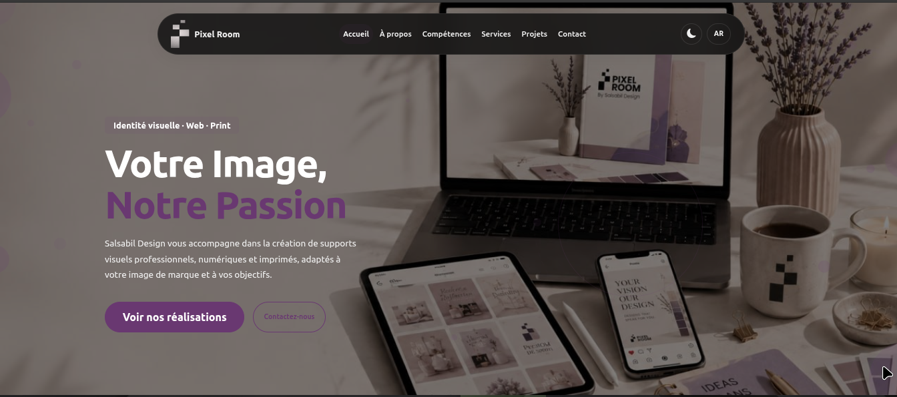

# Pixel Room — SALSABIL DESIGN



A responsive landing page for a graphic design studio, built with Bootstrap 5. Features French/Arabic i18n, dark/light theme, glassmorphism navbar, animated hero, and a separate projects gallery page.

## Features

- **Bilingual** — French (default) and Arabic with RTL support, plus darija in testimonials
- **Dark/Light mode** — persisted in `localStorage` (`pr-theme` key)
- **Floating glassmorphism navbar** — centered, rounded, scroll shadow, identical on all pages
- **Mobile offcanvas drawer** — nav links, theme/lang toggles, social icons
- **Animated hero** — floating icons, pink bubbles, circular photo, entrance animations
- **Scroll-triggered entrance animations** — fade + slide classes observed by IntersectionObserver
- **Responsive** — Bootstrap 5 breakpoints, mobile-first
- **Projects gallery** — separate page with filter tabs (Tous / Numériques / Imprimés), auto-filter via URL param (`?cat=digital|print`)
- **Services** — two category cards (Numériques / Imprimés) with sub-service lists
- **Testimonials** — 4 cards with star rating, darija + French
- **Contact section** — email, hours, social media grid (5 platforms)

## Tech Stack

- [Bootstrap 5.3](https://getbootstrap.com/)
- [Bootstrap Icons](https://icons.getbootstrap.com/) + [Font Awesome 6](https://fontawesome.com/)
- [Google Fonts](https://fonts.google.com/) — Ubuntu (French), Cairo (Arabic)
- Vanilla JavaScript (no framework)
- CSS custom properties for theming

## Color Palette

| Color   | Hex       |
|---------|-----------|
| Purple | `#693871` |
| Black   | `#0a0a0a` |
| White   | `#ffffff` |

## Project Structure

```
.
├── index.html            # Main page (navbar, hero, about, skills, services, testimonials, contact, footer)
├── projects.html         # Projects gallery page
├── css/
│   ├── style.css         # Theme, layout, components, animations
│   └── projects.css      # Projects page specific styles
├── js/
│   ├── main.js           # i18n, theme/lang toggle, navbar scroll, entrance observer, drawer scroll
│   └── projects.js       # Filter tabs, URL param auto-filter
├── images/
│   ├── 1.png             # Logo (light mode)
│   ├── 2.png             # Logo (dark mode)
│   └── girl.jpeg         # Hero photo
└── steps/
    ├── step-01.md
    └── step-02.md
```

## Local Development

Open `index.html` in your browser — no build step required.

```bash
# Serve locally with any HTTP server (recommended for i18n RTL to work properly)
npx serve .
```

## License

All rights reserved. Pixel Room — SALSABIL DESIGN.
